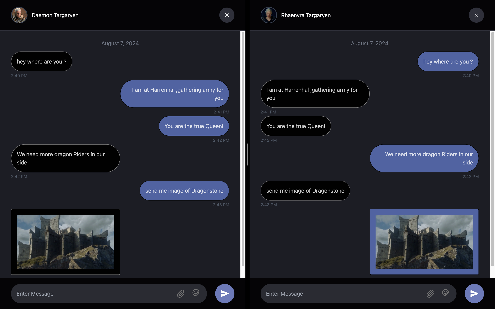

# LoopChat

In the era of fast-paced digital communication, LoopChat emerges as a cutting-edge solution designed to revolutionize real-time interactions. Built on the robust MERN stack (MongoDB, Express.js, React, Node.js), LoopChat harnesses the power of Socket.IO to deliver instant message delivery and uninterrupted conversations. This innovative chat application goes beyond simple text communication, offering features like file and image sharing, making it versatile for personal, professional, and community use. With the ability to create multi-member channels, LoopChat fosters collaboration and teamwork in an intuitive, user-friendly interface. Whether for casual chats or organized discussions, LoopChat is the ultimate platform for seamless, modern communication.

## Table of Contents

- [Overview](#Overview)
- [Features](#features)
- [Dependencies](#dependencies)
- [Git Setup](#Git-Setup)
- [Client Setup](#Client-Setup)
- [Server Setup](#Server-Setup)
- [Usage](#usage)
- [Contributors](#contributors)

## Overview

- LoopChat is a state-of-the-art chat application developed using the MERN stack (MongoDB, Express.js, React, and Node.js), designed to deliver an exceptional real-time messaging experience. Leveraging Socket.IO, the app ensures instantaneous delivery of text messages, files, and images, providing users with a dynamic and versatile communication platform. With features like multi-member channel creation, LoopChat is perfect for fostering collaboration in teams and facilitating vibrant community discussions. Its intuitive, user-friendly interface and robust functionality make it a reliable solution for seamless, modern communication needs.

## Features

- Live Chat: Enjoy seamless real-time communication with instant sending and receiving of messages, ensuring conversations flow without delay.
- Files and Images: Share large files and high-quality images effortlessly, with no quality loss, and experience real-time uploads and downloads for maximum convenience.

  

## Dependencies

- Express
- Mongoose
- Github
- Socket.io
- ImageKit
- ReactJS

## Git-Setup

Clone the repository:

```bash
git clone https://github.com/70IrisLQK/loopchat
cd LoopChat
```

## Client Setup

Redirect to client:

```bash
cd client
```

Install the dependencies:

```bash
npm install
```

Create a .env file:

```bash
VITE_SERVER_URL=""
```

Run client Interface:

```bash
npm run dev
```

## Server Setup

Redirect to server:

```bash
cd server
```

Install the dependencies:

```bash
npm install
```

Create a .env file:

```bash
PORT=

JWT_KEY=

DATABASE_URL=

CLIENT_URL=

IMAGEKIT_PUBLIC_KEY=
IMAGEKIT_PRIVATE_KEY=
IMAGEKIT_URL_ENDPOINT=

```

4. Run Server:

```bash
npm run dev
```

## Usage

Access the app in your web browser at `http://localhost:5173/`.

## Contributors

- KhanhLQ ([GitHub](https://github.com/70IrisLQK))
